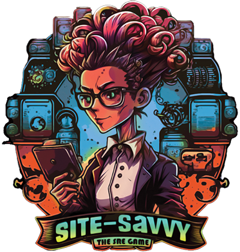

# Site-Savvy Card Game

Site-Savvy is an educational card game designed to teach IT infrastructure concepts through gameplay. Players match and play cards representing different IT roles and services while navigating advantages and challenges that occur in technology environments.

## 🎮 Game Overview

Site-Savvy combines fun gameplay with educational content about how websites, applications, and IT infrastructure work. Players take turns matching cards by color and OSI layer, building their understanding of technology concepts while competing to be the first to play all their cards.

### Key Features:
- **Learn through play**: Absorb complex IT concepts through engaging card gameplay
- **Visual learning**: Color-coded system helps visualize how different technology components connect
- **Real-world relevance**: Cards represent actual IT roles and services found in modern technology organizations
- **Flexible complexity**: Can be played at different levels of detail depending on player age and experience
- **STEM education tool**: Perfect for classrooms, coding clubs, or family game night

## 📋 Repository Contents

- **Cards**: Printable card files including roles, services, advantages, and disadvantages
- **Rules**: Complete game instructions and quick-start guide
- **Printables**: Ready-to-print PDFs for game setup
- **Resources**: Additional educational materials about the OSI model and IT concepts

## 🚀 Getting Started

### To Play the Game:
1. Download and print the card files from the `printables/` directory
2. Cut out the cards and optionally laminate them for durability
3. Read the game rules in `rules/game-rules.md`
4. Gather 2-6 players and start playing!

### For Educators:
The `resources/` directory contains additional materials to help incorporate Site-Savvy into educational curricula. These resources connect game concepts to standard IT education frameworks.

## 🧩 Game Components

### Role Cards
Character cards representing different IT professionals and their responsibilities within technology ecosystems.

### Service Cards
Components of IT infrastructure that work together to create functioning applications and websites.

### Advantage Cards (Green)
Strategic cards that help players progress toward winning.

### Disadvantage Cards (Red)
Challenge cards that create obstacles players must overcome.

## 🔄 OSI Model Integration

Site-Savvy uses the OSI (Open Systems Interconnection) model as a framework for card relationships. The seven layers of the OSI model are represented through color-coding and card interactions:

- **Layers 1-3**: Physical, Data Link, Network (Brown Square, Orange Triangle)
- **Layer 4**: Transport (Orange Triangle, Yellow Diamond)
- **Layers 5-7**: Session, Presentation, Application (Green Hexagon, Blue Circle, Purple Star)
- **Security (Cross-layer)**: Authentication and protection (Pink Heart)

## 👩‍💻 Contributing

Contributions to Site-Savvy are welcome! Please feel free to submit pull requests with:
- New card ideas
- Rule clarifications or expansions
- Additional educational resources
- Translations

## 📝 License

This game is released under Creative Commons Attribution-ShareAlike 4.0 International (CC BY-SA 4.0) License. 

## 🙏 Acknowledgments

This game was created at the University of Minnesota's Urban Research and Outreach Center in partnership with the students at Northside's Plymouth Youth Center. Their creativity, insights, and enthusiasm were instrumental in developing Site-Savvy into an engaging educational tool.

Special thanks to all the educators, IT professionals, and students who contributed to the game's development and testing.
